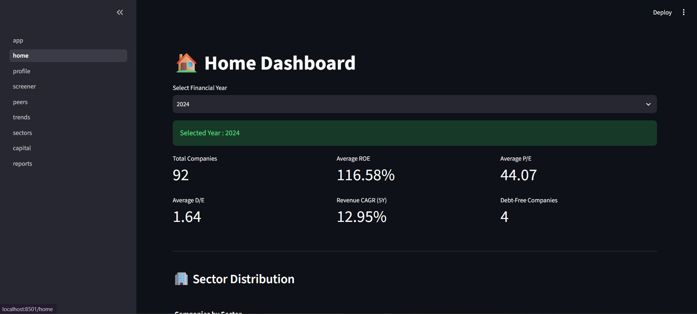
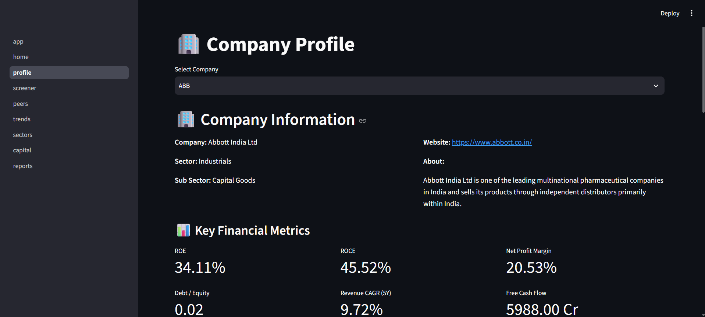
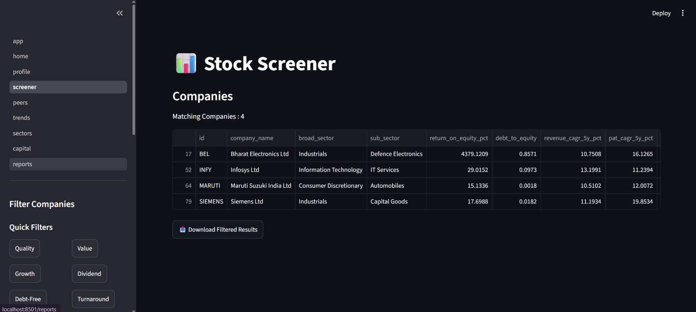
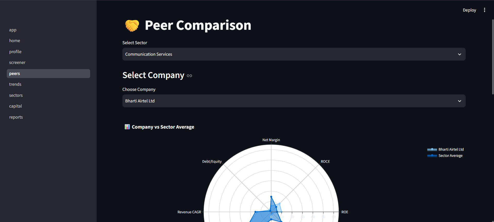
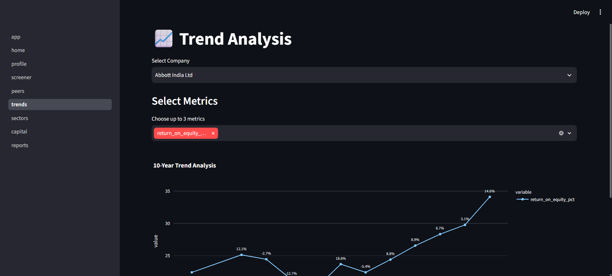
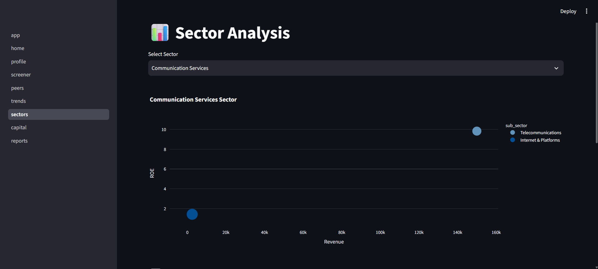
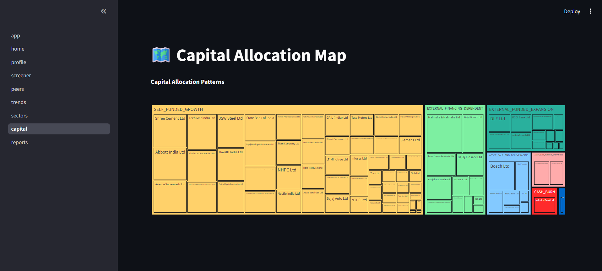
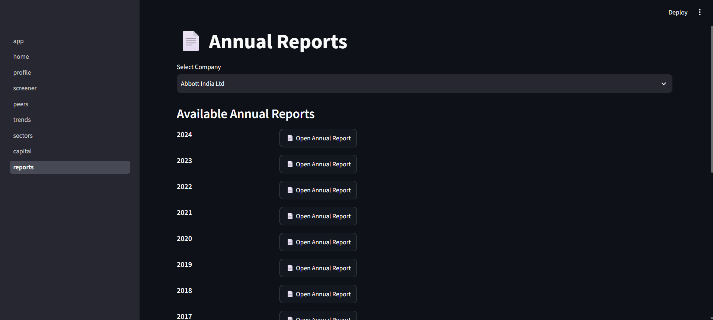

# 📊 N100 Financial Intelligence Platform

A Streamlit-based financial analytics dashboard for Nifty 100 companies. The platform provides company analysis, financial screening, peer comparison, valuation metrics, trend analysis, sector insights, capital allocation visualization, and annual report access.

---

# Features

- Multi-page Streamlit Dashboard
- Home Dashboard with KPI Cards
- Company Profile Analysis
- Financial Stock Screener
- Peer Comparison
- Trend Analysis
- Sector Analysis
- Capital Allocation Map
- Annual Reports Viewer
- Valuation Module
- CSV & Excel Export
- Interactive Plotly Charts

---

# Project Structure

```
N100_FINANCIAL_INTELLIGENCE_PLATFORM/
│
├── config/
├── data/
├── output/
├── reports/
├── src/
│   ├── analytics/
│   ├── dashboard/
│   │   ├── pages/
│   │   └── utils/
│   └── screener/
│
├── README.md
└── requirements.txt
```

---

# Technologies Used

- Python
- Streamlit
- Pandas
- Plotly
- SQLite
- OpenPyXL
- NumPy

---

# Installation

Clone the repository:

```bash
git clone <repository-url>
cd N100_FINANCIAL_INTELLIGENCE_PLATFORM
```

Install dependencies:

```bash
pip install -r requirements.txt
```

---

# Run the Dashboard

```bash
streamlit run src/dashboard/app.py
```

The dashboard will open in your browser.

---

# Dashboard Screens

## 1. Home Dashboard

Displays:

- Total Companies
- Average ROE
- Average P/E
- Average D/E
- Revenue CAGR
- Debt-Free Companies
- Sector Distribution Chart

## Home Dashboard



---

## 2. Company Profile

Displays:

- Company Information
- Financial Ratios
- Profit & Loss
- Balance Sheet
- Cash Flow
- Revenue Trend
- ROE vs ROCE Trend
- Pros & Cons

## Company Profile



---

## 3. Stock Screener

Features:

- Custom Metric Filters
- Preset Filters
- Live Results
- CSV Download

## Stock Screener



---

## 4. Peer Comparison

Displays:

- KPI Comparison
- Sector Average
- Company Metrics

## Peer Comparison



---

## 5. Trend Analysis

Displays:

- Multi-Metric Trend Charts
- Growth Percentage Labels
- 10-Year Financial Trends

## Trend Analysis



---

## 6. Sector Analysis

Displays:

- Sector Bubble Chart
- Sector Median KPI Chart

## Sector Analysis



---

## 7. Capital Allocation Map

Displays:

- Capital Allocation Treemap
- Company Distribution by Allocation Pattern

## Capital Allocation



---

## 8. Annual Reports

Displays:

- Company-wise Annual Reports
- PDF Report Links

## Annual Reports



---

# Output Files

The project generates the following outputs:

- valuation_summary.xlsx
- valuation_flags.csv

---

# Testing

Completed:

- Dashboard Integration Testing
- Multi-Screen Navigation Testing
- Screener Testing
- Valuation Testing
- CSV Export Testing
- Missing Data Handling
- Performance Testing

---

# Sprint 4 Summary

Completed all Sprint 4 objectives:

- Developed an 8-page Streamlit dashboard.
- Implemented financial valuation module.
- Added interactive visualizations.
- Generated valuation reports.
- Integrated SQLite database.
- Performed QA testing and bug fixes.
- Updated documentation.

---

# Future Enhancements

- Live NSE/BSE Data Integration
- User Authentication
- Portfolio Tracking
- AI-Based Stock Recommendation
- Cloud Deployment

---

# Author

**Tamilarasan M**

Data Analyst | Data Science Enthusiast

N100 Financial Intelligence Platform – Sprint 4